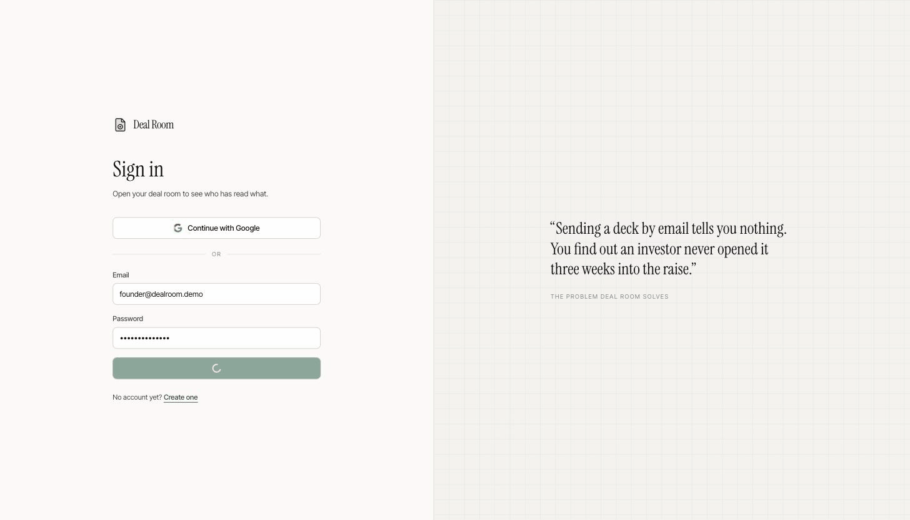

# Deal Room

[](https://github.com/Rufai-Ahmed/deal-room/actions/workflows/ci.yml)

Founders raising investment share fundraising documents as controlled links, and
see whether, when and how closely each investor actually read them.

| | |
| --- | --- |
| **Live app** | https://dealroom.rufaiahmed.com |
| **Sign in** | `founder@dealroom.demo` / `deal-room-demo` |
| **API reference** | https://dealroom.rufaiahmed.com/api/docs |

The demo account is seeded with two documents, four share links and three weeks
of engagement history, so there is something to look at the moment you log in.
To see the investor side, copy any share link from a document and open it.



## The four requirements

| The brief asked for | Where to see it |
| --- | --- |
| Upload a document and give it a name | **Add document** on the deal room page |
| Store it against their account | Documents are scoped to the owner and enforced in the service layer, not the query |
| Generate a share link to send an investor | **Create share link** on any document |
| See when that link was opened | **Every open** on the document page, with an exact timestamp per open |

Everything below that line is the part I thought was actually interesting.

## Four decisions that shaped it

The requirements are four endpoints and an afternoon. The sentence above them is
the real brief: the problem is giving founders *visibility into investor
engagement*. That turns four build tasks into four design questions.

**Whose attention is this?** One link shared with everyone produces one blended
number. Links here are issued per recipient, so a founder compares Northgate
against Brightwater instead of guessing. That is the difference between
analytics and a fundraising tool.

**Is an "open" real?** This one decides whether the product is honest. Paste a
link into Slack, WhatsApp, Outlook or LinkedIn and the platform fetches the URL
to build a preview card. Counted naively, the founder is told an investor read
the deck when nobody has. Those hits are detected, stored with the reason, and
excluded from every figure. The founder can reveal them, which is the point: the
number is defensible rather than flattering.

**"When it was opened" is the floor, not the ceiling.** A timestamp does not
tell a founder whether the deck landed. Time in document and dwell per page do.
Knowing an investor spent five minutes on the traction slide and skipped the
roadmap is the thing they act on.

**Who is reading?** An unguessable URL identifies a link, not a person. Viewers
confirm an email before the file is revealed, so opens attach to a name. It is a
soft gate, and this README says so rather than pretending it is authentication.

## How an open is recorded

```
investor clicks  dealroom.rufaiahmed.com/s/<token>
       |
       v
GET /s/:token                        Nest, before any JavaScript runs
       |  validate token, expiry, revocation
       |  classify user agent, write DocumentView
       |  issue a signed view-session token
       v
302 -> /view/<token>#vs=<session>    fragment, so it stays out of logs
       |
       v
SPA viewer  ->  email gate if required
            ->  signed file URL, valid 15 minutes
            ->  heartbeat every 10s carrying page dwell
```

Recording server side, before the redirect, is deliberate. A client-side ping
misses anyone with scripts blocked and is trivial to suppress. The session token
is signed because heartbeats arrive from an unauthenticated page; without it any
caller could inflate another investor's engagement.

## Architecture

```
apps/web      React SPA      TanStack Router, Redux Toolkit Query, Tailwind
apps/api      NestJS         REST, Prisma, Postgres
libs/shared   TypeScript     the request and response contract, imported by both
```

An Nx workspace, not because two apps need a build system, but because the API
and the client share one contract. `libs/shared` declares every request and
response shape once; Nest controllers return those types and the RTK Query
endpoints are generic over the same ones. Rename a field on the server and the
client fails to typecheck in the same commit.

The API is modular in the Nest sense, one bounded concern per module:

| Module | Owns |
| --- | --- |
| `auth` | registration, login, Google OAuth, JWT issuing |
| `documents` | upload tickets, ownership, metadata |
| `storage` | driver interface with local disk and S3 implementations |
| `sharing` | share links, expiry, revocation, public token resolution |
| `analytics` | view recording, bot classification, dwell aggregation |
| `comments` | investor and founder threads against a share link |
| `notifications` | transactional email |

Modules talk through exported services, never by reaching into another module's
Prisma models.

### Data model

```
User --< Document --< ShareLink --< DocumentView --< PageView
                           \--< Comment
```

Views are rows, not a counter. First open, last open, repeat visits, unique
viewers and per-page dwell all fall out of that one table instead of needing
separate bookkeeping. Comments hang off the share link rather than the document,
so a founder sees which investor asked what without the investor needing an
account.

## Running it locally

Requires Node 22+, pnpm 11 and a Postgres 15+ instance.

```bash
pnpm install
cp apps/api/.env.example apps/api/.env     # set DATABASE_URL and the secrets
pnpm db:generate
pnpm db:migrate
pnpm db:seed
pnpm dev
```

The web app runs on http://localhost:4200 and proxies `/api` and `/s` to the API
on port 3000, so the browser stays on one origin exactly as it does in
production.

| Command | Does |
| --- | --- |
| `pnpm dev` | API and web together |
| `pnpm test` | Unit tests for both projects |
| `pnpm typecheck` | Typecheck every project |
| `pnpm build` | Production build of both |
| `pnpm db:seed` | Reset and reseed the demo founder |

Storage defaults to a local disk driver that serves files back through signed
URLs, so the viewer path behaves the same locally as it does against S3. Google
sign-in and email notifications stay switched off until their keys are present,
and the login page hides the Google button accordingly.

## Testing

Tests cover the places where a defect is silent rather than loud:

- bot classification, including the real Telegram agent that also names Twitter
- password hashing, salting, and rejection of foreign hash formats
- link status across expiry and revocation, and 410 versus 404 behaviour
- ownership isolation, so one founder cannot revoke another's link
- dwell clamping against inflated, negative and out of range heartbeats

CI typechecks, tests and builds every project on push.

## Assumptions

- **A share link is a bearer credential.** Anyone holding the URL can open the
  document, subject to expiry and revocation. The email gate attributes a view,
  it does not authenticate.
- **View-only is a deterrent, not DRM.** A determined viewer can still capture
  what they can see.
- **Dwell time is best effort.** It accrues only while the tab is visible and is
  clamped to the wall clock since the view opened. A strong signal, not an audit
  record.
- **One founder per account**, and documents are archived rather than destroyed,
  because deleting a fundraising audit trail on one click is the wrong default.
- **List endpoints are not paginated.** Analytics returns every view for a
  document in one response, which is right for a raise with tens of opens and
  wrong at thousands. The cut is a cursor on views and the activity feed, and
  moving the aggregation into SQL rather than the application.
